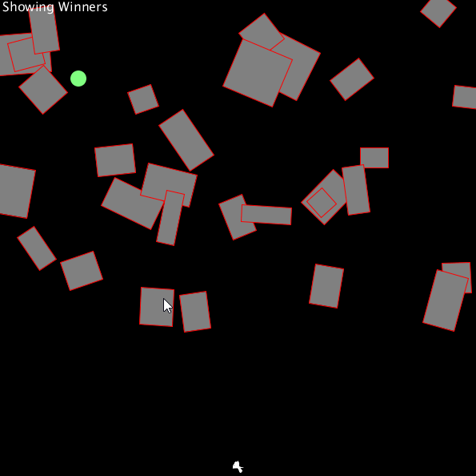

# ProcessingSmartRockets
Based on The Coding Train P5 example (https://www.youtube.com/watch?v=bGz7mv2vD6g&t=985s)
Rendered and coded using Processing (https://processing.org/)

I decided to use a slightly different approach for the generational learning. I always keep one rocket that was the best, so it can seed into the new generation. I also give a percent of deviants to the new generation, so completely new approaches can be added to the dna.

I tried adding trails to the rockets, but that slowed down processing significantly, and I just took them out for FPS sake. I am sure it is my limited knowledge in how to correctly render in processing.

Here is an example of the best of each generation (only if the generation has a better one) for 300 generations.

